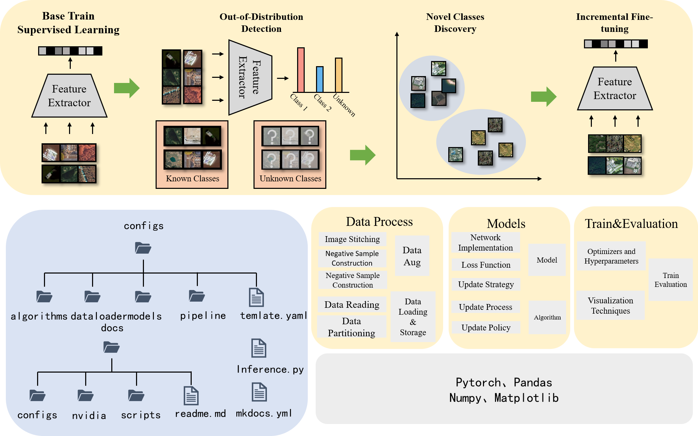

<div align="center">
  <h1>🌍 OpenHAIV</h1>
  <p>A Framework for <b>Open-World Learning</b></p>
</div>
<div align="center">

[](your_link)[](https://www.python.org/) [](https://pytorch.org/)

<!-- [](your_link) -->

[[Manual]](https://haiv-lab.github.io/openhaiv)
[[Arxiv]](https://arxiv.org/abs/2508.07270)
[[Dataset]](https://haiv-lab.github.io/OES)
[[Forum]](https://haiv-lab.github.io/low-altitude)

Star to bookmark, fork if you use, and welcome to contribute!

</div>

### 👋 Welcome to OpenHAIV

<div align="center">
  
</div>

**OpenHAIV** is a comprehensive framework for open-world object recognition, supporting ***out-of-distribution detection***, ***novel class discovery***, and ***incremental learning***. It is designed to enable robust and flexible object recognition in unconstrained environments.

<div align="center">
  
</div>

The framework adopts a modular design overall, which is reflected in two key aspects.

- **🛠️ Functionally**: The framework independently incorporates dedicated modules for *supervised training*, *out-of-distribution detection*, *novel class discovery*, and *incremental learning*.
- **⚙️ Procedurally**：The framework divides its operational workflow into distinct stages, including data processing, model construction, training and evaluation, and visualization.

#### ⭐ Key Features

##### 🧩 Modular Design

- Easy experimentation with different algorithms
- Seamless integration of new techniques
- Flexible deployment configurations

##### 🚀 Scalable Architecture

- Large-scale dataset processing
- Distributed training capabilities
- Efficient memory management
- Parallel processing optimization

##### 🔌 Extensible Framework

- Plugin-based algorithm integration
- Custom loss function support
- Flexible evaluation metrics
- Comprehensive logging and monitoring

### 📑 Table of Contents

- [👋 Welcome to OpenHAIV](#-welcome-to-openhaiv)
- [📑 Table of Contents](#-table-of-contents)
- [🎉 News](#-news)
- [📋 TODO List](#-todo-list)
- [🚀 Getting Started](#-getting-started)
  - [📦 Installation](#-installation)
  - [🔧 Environment Setup](#-environment-setup)
  - [🏃‍♂️ Running Examples](#️-running-examples)
- [🤖 Supported Models](#-supported-models)
- [📚 Supported Methods](#-supported-methods)
  - [🌱 Class-incremental learning](#-class-incremental-learning)
  - [🚨 Out-of-Distribution Detection](#-out-of-distribution-detection)
  - [🔍 Novel Class Discovery](#-novel-class-discovery)
  - [🧬 Data Augmentation](#-data-augmentation)
- [🛠️ Contributing Guidelines](#️-contributing-guidelines)
  - [🧹 Code Style](#-code-style)
  - [📜 Code of Conduct](#-code-of-conduct)
  - [🐛 Reporting Issues](#-reporting-issues)
  - [💡 Submitting Pull Requests](#-submitting-pull-requests)
- [🤝Contributors](#contributors)
- [📖Citation](#citation)
- [🙏Acknowledgement](#acknowledgement)
- [✉️Contact](#️contact)

### 🎉 News
[08/2025] 🌟 Our paper "OpenHAIV: A Framework Towards Practical Open-World Learning" is available at [[Arxiv]](https://arxiv.org/abs/2508.07270).
[08/2025] 🌟 The code repository is is now publicly available.
[09/2024] 🌟 The code repository is created.

### 📋 TODO List

- [x] Implement core framework structure
- [x] Support basic OOD detection methods
- [x] Support basic class-incremental learning methods
- [ ] Complete Novel Class Discovery implementation
- [ ] Add comprehensive benchmarks and evaluation metrics
- [ ] Add Data Augmentation techniques
- [ ] Create detailed documentation and tutorials
- [ ] Add visualization tools for analysis
- [ ] Support Windows & macOS installation guide
- [ ] Create Jupyter notebook examples
- [ ] Set up continuous integration for testing
- [ ] Add pre-trained model zoo
- [ ] Implement unified evaluation protocols

<!-- ### ⚙️ Installation
It is recommended to use anaconda3 to manage and maintain the python library environment.
1. Download the .sh file from the anaconda3 website
2. install anaconda3 with .sh file
```
bash Anaconda3-2023.03-Linux-x86_64.sh
```

#### Create Virtual Environment
```
conda create -n ncdia python=3.10 -y
conda activate ncdia
pip install -r requirements.txt
python setup.py install
```

#### Install Package
* pytorch>=1.12.0 torchvision>=0.13.0 (recommand offical torch command)
* numpy>=1.26.4
* scipy>=1.14.0
* scikit-learn>=1.5.1

#### Train and Evaluation

Example For OOD:
```
python ncdia/train.py     --cfg configs/pipeline/ood_detection/msp/det_oes_rn50_msp_train.yaml     --opts device='cuda:0'
```

Example For CIL:
```
bash ./scripts/inc_BM200_lwf.sh  
```

Example For NCD:
```
Set model weight in weight_path.  
Set id_txt_file and ood_txt_file.  
Set output_dir.  

Run:  
python ncd.py
``` -->

### 🚀 Getting Started

#### 📦 Installation

It is recommended to use anaconda3 to manage and maintain the python library environment.

1. Download the .sh file from the anaconda3 website
2. Install anaconda3 with .sh file

```bash
bash Anaconda3-2023.03-Linux-x86_64.sh
```

#### 🔧 Environment Setup

Create and activate a virtual environment:

```bash
conda create -n openhaiv python=3.10 -y
conda activate openhaiv
pip install -r requirements.txt
python setup.py install
```

Required packages:

- pytorch>=1.12.0 torchvision>=0.13.0 (recommend official torch command)
- numpy>=1.26.4
- scipy>=1.14.0
- scikit-learn>=1.5.1

#### 🏃‍♂️ Running Examples

#### Out-of-Distribution Detection

```bash
python ncdia/train.py --cfg configs/pipeline/ood_detection/msp/det_oes_rn50_msp_train.yaml --opts device='cuda:0'
```

#### Class-incremental Learning

```bash
bash ./scripts/inc_BM200_lwf.sh  
```

#### Novel Class Discovery

```bash
# Set required parameters
# - model weight in weight_path
# - id_txt_file and ood_txt_file
# - output_dir

python ncd.py
```

### 🤖 Supported Models

  `ResNet`、`ViT`、`CLIP`
<!-- | Model | Description |
|-------|-------------|
| `ResNet` | Deep Residual Networks |
| `ViT` | Vision Transformer |
| `CLIP` | Contrastive Language-Image Pre-Training | -->

### 📚 Supported Methods

#### 🌱 Class-incremental learning

<details>
  <summary> <b>CNN-based methods</b></summary>

- `Joint`: update models using all the data from all classes.
- `Finetune`: baseline method which simply update model using current data.
- `LwF`: Learning without Forgetting. ECCV 2016 [[paper](https://arxiv.org/abs/1606.09282)]
- `EWC`: Overcoming catastrophic forgetting in neural networks. PNAS 2017 [[paper](https://arxiv.org/abs/1612.00796)]
- `iCaRL`: Incremental Classifier and Representation Learning. CVPR 2017 [[paper](https://arxiv.org/abs/1611.07725)]
- `BiC`: Large Scale Incremental Learning. CVPR 2019 [[paper](https://arxiv.org/abs/1905.13260)]
- `WA`: Maintaining Discrimination and Fairness in Class Incremental Learning. CVPR 2020 [[paper](https://arxiv.org/abs/1911.07053)]
  <!-- -  `DER`: DER: Dynamically Expandable Representation for Class Incremental Learning. CVPR 2021 [[paper](https://arxiv.org/abs/2103.16788)]-->
  <!---  `Coil`: Co-Transport for Class-Incremental Learning. ACM MM 2021 [[paper](https://arxiv.org/abs/2107.12654)] -->
- `GEM`: Gradient Episodic Memory for Continual Learning. NIPS2017 [[paper](https://arxiv.org/abs/1706.08840)]
- `SSRE`: Large Scale Incremental Learning. CVPR2019 [[paper](https://arxiv.org/abs/1905.13260)]

</details>

<details>
  <summary> <b>ViT-based methods</b></summary>
     - `Joint`: update models using all the data from all classes.
</details>

<details>
  <summary> <b>CLIP-based methods</b></summary>
</details>


<details>
  <summary> <b>Few-shot class-incremental learning</b></summary>

- `Joint`: update models using all the data from all classes.
- `Alice`: Few-Shot Class-Incremental Learning from an Open-Set Perspective. ECCV 2022 [[paper](https://arxiv.org/abs/2208.00147)]
- `FACT`: Forward Compatible Few-Shot Class-Incremental Learning. CVPR 2022 [[paper](https://arxiv.org/abs/2203.06953)]
- `SAVC`: Learning with Fantasy: Semantic-Aware Virtual Contrastive Constraint for Few-Shot Class-Incremental Learning. CVPR 2023 [[paper](https://arxiv.org/abs/2304.00426)]
  
</details>

#### 🚨 Out-of-Distribution Detection

<details>
  <summary> <b>Unimodal Methods</b></summary>

<details>
  <summary> <b>Post-hoc Methods</b></summary>

  <!-- - `OpenMax`: . CVPR 2016[[paper]()] -->
- `MSP`: A Baseline for Detecting Misclassified and Out-of-Distribution Examples in Neural Networks. ICLR 2017[[paper](https://arxiv.org/abs/1610.02136)]
- `ODIN`: Enhancing The Reliability of Out-of-distribution Image Detection in Neural Networks. ICLR 2018[[paper](https://arxiv.org/abs/1706.02690)]
- `MDS`: A Simple Unified Framework for Detecting Out-of-Distribution Samples and Adversarial Attacks. NeurIPS 2018[[paper](https://arxiv.org/abs/1807.03888)]
  <!-- - `GRAM`: Detecting Out-of-Distribution Examples with In-distribution Examples and Gram Matrices. ICML 2020[[paper](https://arxiv.org/abs/1912.12510)]
  - `EBO`: Energy-based Out-of-distribution Detection. NeurIPS 2020[[paper](https://arxiv.org/abs/2010.03759)]
  - `RMDS`: A Simple Fix to Mahalanobis Distance for Improving Near-OOD Detection. Arxiv 2021[[paper](https://arxiv.org/abs/2106.09022)] -->
  <!-- - `GranNorm`: On the Importance of Gradients for Detecting Distributional Shifts in the Wild. NeurIPS 2021[[paper](https://arxiv.org/abs/2110.00218)]
  - `React`: ReAct: Out-of-distribution Detection With Rectified Activations. NeurIPS 2021[[paper](https://arxiv.org/abs/2111.12797)] -->
  <!-- - `SEM`: . Arxiv 2022[[paper]()] -->
- `MLS`: Scaling Out-of-Distribution Detection for Real-World Settings. ICML 2022[[paper](https://arxiv.org/abs/1911.11132)]
  <!-- - `KLM`: Scaling Out-of-Distribution Detection for Real-World Settings. ICML 2022[[paper](https://arxiv.org/abs/1911.11132)]
  - `KNN`: Out-of-Distribution Detection with Deep Nearest Neighbors. ICML 2022[[paper](https://arxiv.org/abs/2204.06507)] -->
- `ViM`: ViM: Out-Of-Distribution with Virtual-logit Matching. CVPR 2022[[paper](https://arxiv.org/abs/2203.10807)]
  <!-- - `Dice`: DICE: Leveraging Sparsification for Out-of-Distribution Detection. ECCV 2022[[paper](https://arxiv.org/abs/2111.09805)]
  - `RankFeat`: RankFeat: Rank-1 Feature Removal for Out-of-distribution Detection. NeurIPS 2022[[paper](https://arxiv.org/abs/2209.08590)] -->
  <!-- - `ASH`: Extremely Simple Activation Shaping for Out-of-Distribution Detection. ICLR 2023[[paper](https://arxiv.org/abs/2209.09858)]
  - `SHE`: . ICLR 2023[[paper]()] -->
  <!-- - `GEN`:  GEN: Pushing the Limits of Softmax-Based Out-of-Distribution Detection. CVPR 2023[[paper](https://openaccess.thecvf.com/content/CVPR2023/papers/Liu_GEN_Pushing_the_Limits_of_Softmax-Based_Out-of-Distribution_Detection_CVPR_2023_paper.pdf)]
  - `NNGuide`: Nearest Neighbor Guidance for Out-of-Distribution Detection. ICCV 2023[[paper](https://arxiv.org/abs/2309.14888)] -->
  <!-- - `Relation`: Neural Relation Graph: A Unified Framework for Identifying Label Noise and Outlier Data. NeurIPS 2023[[paper](https://arxiv.org/abs/2301.12321)] -->
  <!-- - `Scale`: Scaling for Training Time and Post-hoc Out-of-distribution Detection Enhancement. ICLR 2024[[paper](https://arxiv.org/abs/2310.00227)] -->
- `FDBD`: Fast Decision Boundary based Out-of-Distribution Detector. ICML 2024[[paper](https://arxiv.org/abs/2312.11536)]
  <!--- `AdaScale A`: AdaSCALE: Adaptive Scaling for OOD Detection. Arxiv 2025[[paper](https://arxiv.org/abs/2503.08023)]-->
  <!--- `AdaScale L`: AdaSCALE: Adaptive Scaling for OOD Detection. Arxiv 2025[[paper](https://arxiv.org/abs/2503.08023)]-->
  <!--- `IODIN`: Going Beyond Conventional OOD Detection. Arxiv 2025[[paper](https://arxiv.org/abs/2411.10794)]-->
  <!--- `NCI`: Detecting Out-of-Distribution Through the Lens of Neural Collapse. CVPR 2025[[paper](https://arxiv.org/abs/2311.01479)]-->
  
</details>

<details>
  <summary> <b>Training Methods</b></summary>

  <!-- - `ConfBranch`: Learning Confidence for Out-of-Distribution Detection in Neural Networks. Arxiv 2018 [[paper](https://arxiv.org/abs/1802.04865)]
  - `RotPred`: Using Self-Supervised Learning Can Improve Model Robustness and Uncertainty. NeurIPS 2018 [[paper](https://arxiv.org/abs/1906.12340)]
  - `GODIN`: Generalized ODIN: Detecting Out-of-distribution Image without Learning from Out-of-distribution Data. CVPR 2020[[paper](https://arxiv.org/abs/2002.11297)] -->
  <!--- `CSI`: CSI: Novelty Detection via Contrastive Learning on Distributionally Shifted Instances. NeurIPS 2020[[paper](https://arxiv.org/abs/2002.11297)]-->
  <!-- - `SSD`: SSD: A Unified Framework for Self-Supervised Outlier Detection. ICLR 2021[[paper](https://arxiv.org/abs/2103.12051)] -->
  <!-- - `MOS`: MOS: Towards Scaling Out-of-distribution Detection for Large Semantic Space. CVPR 2021[[paper](https://arxiv.org/abs/2105.01879)] -->
- `VOS`: VOS: Learning What You Don't Know by Virtual Outlier Synthesis. ICLR 2022[[paper](https://arxiv.org/abs/2202.01197)]
- `LogitNorm`: Mitigating Neural Network Overconfidence with Logit Normalization. ICML 2022[[paper](https://arxiv.org/abs/2205.09310)]
  <!-- - `CIDER`: How to Exploit Hyperspherical Embeddings for Out-of-Distribution Detection?. ICLR 2023[[paper](https://arxiv.org/abs/2203.04450)] -->
  <!--- `NPOS`: Non-Parametric Outlier Synthesis. ICLR 2023[[paper](https://arxiv.org/abs/2303.02966)]-->
- `DML`: Decoupling MaxLogit for Out-of-Distribution Detection. CVPR 2023[[paper](https://openaccess.thecvf.com/content/CVPR2023/papers/Zhang_Decoupling_MaxLogit_for_Out-of-Distribution_Detection_CVPR_2023_paper.pdf)]
  <!--- `ISH`: Scaling for Training Time and Post-hoc Out-of-distribution Detection Enhancement. ICLR 2024[[paper](https://arxiv.org/abs/2310.00227)]-->
  <!--- `PALM`: Learning with Mixture of Prototypes for Out-of-Distribution Detection. ICLR 2024[[paper](https://arxiv.org/abs/2402.02653)]-->
  <!--- `T2FNorm`: T2FNorm: Train-time Feature Normalization for OOD Detection
  in Image Classification. CVPRW 2024[[paper](https://openaccess.thecvf.com/content/CVPR2024W/TCV2024/papers/Regmi_T2FNorm_Train-time_Feature_Normalization_for_OOD_Detection_in_Image_Classification_CVPRW_2024_paper.pdf)]-->
  <!--- `ReweightOOD`: ReweightOOD: Loss Reweighting for Distance-based OOD Detection. CVPRW 2024[[paper](https://openaccess.thecvf.com/content/CVPR2024W/TCV2024/papers/Regmi_ReweightOOD_Loss_Reweighting_for_Distance-based_OOD_Detection_CVPRW_2024_paper.pdf)]-->
  <!--- `ASCOOD`: Going Beyond Conventional OOD Detection. Arxiv 2025[[paper](https://arxiv.org/abs/2411.10794)]-->
  <!--###### Method Uncertainty
  - `MC-Dropout`: . ICML 2016[[paper]()]
  - `Deep-ensemble`: . NeurIPS 2017[[paper]()]
  - `Temp-scaling`: . ICML 2017[[paper]()]
  - `RTS`: . AAAI 2023[[paper]()]-->
</details>

</details>

<details>
  <summary> <b> CLIP-based Methods </b></summary>
  - `MCM`: Delving into Out-of-Distribution Detection with Vision-Language Representations. NeurIPS 2022[[paper](https://arxiv.org/abs/2211.13445)]
  - `GL-MCM`: GL-MCM: Global and Local Maximum Concept Matching for Zero-Shot Out-of-Distribution Detection. IJCV 2025[[paper](https://arxiv.org/abs/2304.04521)]
  <!-- - `NegLabel`: Negative Label Guided OOD Detection with Pretrained Vision-Language Models. ICLR 2024[[paper](https://arxiv.org/abs/2403.20078)] -->
  - `CoOp`: Learning to Prompt for Vision-Language Models. IJCV 2022[[paper](https://arxiv.org/abs/2109.01134)]
  - `LoCoOp`: LoCoOp: Few-Shot Out-of-Distribution Detection via Prompt Learning. NeurIPS 2023[[paper](https://arxiv.org/abs/2306.01293)]
  - `SCT`: Self-Calibrated Tuning of Vision-Language Models for Out-of-Distribution Detection. NeurIPS 2024[[paper](https://arxiv.org/abs/2411.03359)]
  <!--- `Maple`: MaPLe: Multi-modal Prompt Learning. CVPR 2023[[paper](https://arxiv.org/abs/2210.03117)]-->
  - `DPM`: Vision-Language Dual-Pattern Matching for Out-of-Distribution Detection. ECCV 2024[[paper](https://www.ecva.net/papers/eccv_2024/papers_ECCV/papers/11399.pdf)]
  <!--- `CALIP`: CALIP: Zero-Shot Enhancement of CLIP with Parameter-free Attention. AAAI 2023[[paper](https://arxiv.org/abs/2209.14169)]-->
  <!--- `Tip-Adapter`: Tip-Adapter: Training-free CLIP-Adapter for Better Vision-Language Modeling. ECCV 2022[[paper](https://arxiv.org/abs/2111.03930)]-->
  <!--- `NegPrompt`: Learning Transferable Negative Prompts for Out-of-Distribution Detection. CVPR 2024[[paper](https://arxiv.org/abs/2404.03248)]-->
</details>

</details>

#### 🔍 Novel Class Discovery

TBD

#### 🧬 Data Augmentation

TBD

### 🛠️ Contributing Guidelines

We welcome contributions to OpenHAIV🤗
If you're interested in improving the project, please follow these guidelines:

#### 🧹 Code Style

This project uses [pre-commit](https://pre-commit.com/) to automatically enforce code style and quality before each commit. Please install pre-commit and run:

```bash
pip install pre-commit
pre-commit install
```

The main checks include:

- flake8: PEP8 code style checking
- yapf: automatic Python code formatting
- codespell: spell checking
- docformatter: automatic docstring formatting
- trailing-whitespace, end-of-file-fixer, mixed-line-ending and other basic formatting fixes

See the `.pre-commit-config.yaml` file for detailed configuration. All these checks and fixes will be run automatically before every commit.

#### 📜 Code of Conduct

Please note that all contributors are expected to follow our [Code of Conduct](CODE_OF_CONDUCT.md) to foster a welcoming and inclusive community.

#### 🐛 Reporting Issues

1. **Check existing issues** first to avoid duplicates
2. **Use the issue template** when available
3. **Be specific** about the problem:
   - Include steps to reproduce
   - Provide environment details (OS, Python version, dependencies)
   - Add screenshots if applicable
   - Describe expected vs. actual behavior

#### 💡 Submitting Pull Requests

1. **Create an issue first** to discuss major changes
2. **Fork the repository** and create a branch from `main`
3. **Follow the coding style** used throughout the project:
   - Adhere to PEP 8 guidelines
   - Use meaningful variable/function names
   - Add docstrings for new functions/classes
4. **Write tests** for new features
5. **Ensure all tests pass** before submitting
6. **Update documentation** reflecting your changes
7. **Make atomic commits** with clear messages

### 🤝Contributors

Xiang Xiang, Qinhao Zhou, Jing Ma, Zhuo Xu, Jiaxin Dai, Yifan Liang, Hanlin Li, Yao Deng, Zhipeng Chen, Zihan Zhang, Yuwen Tan.

<!-- 以下内容在代码仓库公开后可以启用  -->
<!-- <a href="https://github.com/HAIV-Lab/openhaiv/graphs/contributors">
  
</a> -->

### 📖Citation

If you find our repository useful for your research, please consider citing these papers:


```bibtex
@article{xiang2025openhaiv,
  title={OpenHAIV: A Framework Towards Practical Open-World Learning},
  author={Xiang, Xiang and Zhou, Qinhao and Xu, Zhuo and Ma, Jing and Dai, Jiaxin and Liang, Yifan and Li, Hanlin},
  journal={arXiv preprint arXiv:2508.07270},
  year={2025},
  url={https://arxiv.org/abs/2508.07270},
  doi={10.48550/arXiv.2508.07270}
}
```

### 🙏Acknowledgement

- [OpenOOD](https://github.com/Jingkang50/OpenOOD), an extensible codebase for out-of-distribution detection with Vision Models only.
- [OpenOOD-VLM](https://github.com/YBZh/OpenOOD-VLM), an extensible codebase for out-of-distribution detection with both Vision Models and Vision-Language Models.
- [PyCIL](https://github.com/G-U-N/PyCIL), an extensible codebase for incremental learning.

### ✉️Contact

If there are any questions, please feel free to propose new features by opening an issue or contact with the team leader: Xiang Xiang (<xex@hust.edu.cn>). Enjoy the code.
