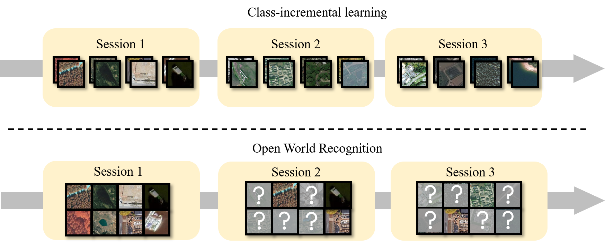

<div align="center">
  <h1>🌍 OpenHAIV</h1>
  <p>A Framework for <b>Open-World Learning</b></p>
</div>
<div align="center">

[](your_link)[](https://www.python.org/) [](https://pytorch.org/)

<!-- [](your_link) -->

[[Manual]](https://haiv-lab.github.io/openhaiv)
[[Arxiv]](https://arxiv.org/abs/2508.07270)
[[Dataset]](https://haiv-lab.github.io/OES)
[[Forum]](https://haiv-lab.github.io/low-altitude)

Star to bookmark, fork & cite if you use, and welcome to contribute!

</div>

### 👋 Welcome to OpenHAIV

<div align="center">
  
</div>

**OpenHAIV** is a comprehensive framework for open-world object recognition, supporting ***out-of-distribution detection***, ***novel class discovery***, and ***incremental learning***. It is designed to enable robust and flexible object recognition in unconstrained environments.

<div align="center">
  
</div>

The framework adopts a modular design overall, which is reflected in two key aspects.

- **🛠️ Functionally**: The framework independently incorporates dedicated modules for *supervised training*, *out-of-distribution detection*, *novel class discovery*, and *incremental learning*.
- **⚙️ Procedurally**：The framework divides its operational workflow into distinct stages, including data processing, model construction, training and evaluation, and visualization.

#### ⭐ Key Features

##### 🧩 Modular Design

- Easy experimentation with different algorithms
- Seamless integration of new techniques
- Flexible deployment configurations

##### 🚀 Scalable Architecture

- Large-scale dataset processing
- Distributed training capabilities
- Efficient memory management
- Parallel processing optimization

##### 🔌 Extensible Framework

- Plugin-based algorithm integration
- Custom loss function support
- Flexible evaluation metrics
- Comprehensive logging and monitoring

### 📑 Table of Contents

- [👋 Welcome to OpenHAIV](#-welcome-to-openhaiv)
- [📑 Table of Contents](#-table-of-contents)
- [🎉 News](#-news)
- [📋 TODO List](#-todo-list)
- [🚀 Getting Started](#-getting-started)
  - [📦 Installation](#-installation)
  - [🔧 Environment Setup](#-environment-setup)
  - [🏃‍♂️ Running Examples](#️-running-examples)
- [🤖 Supported Models](#-supported-models)
- [📚 Supported Methods](#-supported-methods)
  - [🌱 Class-incremental learning](#-class-incremental-learning)
  - [🚨 Out-of-Distribution Detection](#-out-of-distribution-detection)
  - [🔍 Novel Class Discovery](#-novel-class-discovery)
  - [🧬 Data Augmentation](#-data-augmentation)
- [🛠️ Contributing Guidelines](#️-contributing-guidelines)
  - [🧹 Code Style](#-code-style)
  - [📜 Code of Conduct](#-code-of-conduct)
  - [🐛 Reporting Issues](#-reporting-issues)
  - [💡 Submitting Pull Requests](#-submitting-pull-requests)
- [🤝Contributors](#contributors)
- [📖Citation](#citation)
- [🙏Acknowledgement](#acknowledgement)
- [✉️Contact](#️contact)

### 🎉 News
[08/2025] 🌟 Our paper "OpenHAIV: A Framework Towards Practical Open-World Learning" is available at [[Arxiv]](https://arxiv.org/abs/2508.07270).
[08/2025] 🌟 The code repository is is now publicly available.
[09/2024] 🌟 The code repository is created.

### 📋 TODO List

- [x] Implement core framework structure
- [x] Support basic OOD detection methods
- [x] Support basic class-incremental learning methods
- [ ] Complete Novel Class Discovery implementation
- [ ] Add comprehensive benchmarks and evaluation metrics
- [ ] Add Data Augmentation techniques
- [ ] Create detailed documentation and tutorials
- [ ] Add visualization tools for analysis
- [ ] Support Windows & macOS installation guide
- [ ] Create Jupyter notebook examples
- [ ] Set up continuous integration for testing
- [ ] Add pre-trained model zoo
- [ ] Implement unified evaluation protocols

<!-- ### ⚙️ Installation
It is recommended to use anaconda3 to manage and maintain the python library environment.
1. Download the .sh file from the anaconda3 website
2. install anaconda3 with .sh file
```
bash Anaconda3-2023.03-Linux-x86_64.sh
```

#### Create Virtual Environment
```
conda create -n ncdia python=3.10 -y
conda activate ncdia
pip install -r requirements.txt
python setup.py install
```

#### Install Package
* pytorch>=1.12.0 torchvision>=0.13.0 (recommend official torch command)
* numpy>=1.26.4
* scipy>=1.14.0
* scikit-learn>=1.5.1

#### Train and Evaluation

Example For OOD:
```
python ncdia/train.py     --cfg configs/pipeline/ood_detection/msp/det_oes_rn50_msp_train.yaml     --opts device='cuda:0'
```

Example For CIL:
```
bash ./scripts/inc_BM200_lwf.sh
```

Example For NCD:
```
Set model weight in weight_path.
Set id_txt_file and ood_txt_file.
Set output_dir.

Run:
python ncd.py
``` -->

### 🚀 Getting Started

#### 📦 Installation

It is recommended to use anaconda3 to manage and maintain the python library environment.

1. Download the .sh file from the anaconda3 website
2. Install anaconda3 with .sh file

```bash
bash Anaconda3-2023.03-Linux-x86_64.sh
```

#### 🔧 Environment Setup

Create and activate a virtual environment:

```bash
conda create -n openhaiv python=3.10 -y
conda activate openhaiv
pip install -r requirements.txt
python setup.py install
```

Required packages:

- pytorch>=1.12.0 torchvision>=0.13.0 (recommend official torch command)
- numpy>=1.26.4
- scipy>=1.14.0
- scikit-learn>=1.5.1

#### 🏃‍♂️ Running Examples

#### Out-of-Distribution Detection

```bash
python ncdia/train.py --cfg configs/pipeline/ood_detection/msp/det_oes_rn50_msp_train.yaml --opts device='cuda:0'
```

#### Class-incremental Learning

```bash
bash ./scripts/inc_BM200_lwf.sh
```

#### Novel Class Discovery

```bash
# Set required parameters
# - model weight in weight_path
# - id_txt_file and ood_txt_file
# - output_dir

python ncd.py
```

### 🤖 Supported Models

  `ResNet`、`ViT`、`CLIP`
<!-- | Model | Description |
|-------|-------------|
| `ResNet` | Deep Residual Networks |
| `ViT` | Vision Transformer |
| `CLIP` | Contrastive Language-Image Pre-Training | -->

### 📚 Supported Methods

#### 🌱 Class-incremental learning

<details>
  <summary> <b>CNN-based methods</b></summary>

| Method   | Paper | Venue|
|----------|-------------|--|
|`Joint`|update models using all the data from all classes||
|`Finetune`|baseline method which simply updates model using current data||
|`LwF`|[**Learning without Forgetting**](https://arxiv.org/abs/1606.09282)|**ECCV 2016**|
|`EWC`|[**Overcoming catastrophic forgetting in neural networks**](https://arxiv.org/abs/1612.00796)|**PNAS 2017**|
|`iCaRL`|[**Incremental Classifier and Representation Learning**](https://arxiv.org/abs/1611.07725)|**CVPR 2017**|
|`BiC`|[**Large Scale Incremental Learning**](https://arxiv.org/abs/1905.13260)|**CVPR 2019**|
|`WA`|[**Maintaining Discrimination and Fairness in Class Incremental Learning**](https://arxiv.org/abs/1911.07053)|**CVPR 2020**|
<!-- |`DER`|[**Dynamically Expandable Representation for Class Incremental Learning**](https://arxiv.org/abs/2103.16788)|**CVPR 2021**| -->
<!-- |`Coil`|[**Co-Transport for Class-Incremental Learning**](https://arxiv.org/abs/2107.12654)|**ACM MM 2021**| -->
|`GEM`|[**Gradient Episodic Memory for Continual Learning**](https://arxiv.org/abs/1706.08840)|**NIPS 2017**|
|`SSRE`|[**Self-Sustaining Representation Expansion for Non-Exemplar Class-Incremental Learning**](https://arxiv.org/abs/2203.06359)|**CVPR 2022**|
<!-- |`FOSTER`|[**Feature Boosting and Compression for Class-incremental Learning**](https://arxiv.org/abs/2204.04662)|**ECCV 2022**| -->
<!-- |`FeTrIL`|[**Feature Translation for Exemplar-Free Class-Incremental Learning**](https://arxiv.org/abs/2211.13131)|**WACV 2023**| -->
<!-- |`MEMO`|[**Memory-Efficient Class-Incremental Learning**](https://openreview.net/forum?id=S07feAlQHgM)|**ICLR 2023**| -->

</details>

<details>
  <summary> <b>ViT-based methods</b></summary>

| Method   | Paper | Venue|
|----------|-------------|--|
|`Joint`|update models using all the data from all classes||
|`Finetune`|baseline method which simply updates model using current data||

</details>

<details>
  <summary> <b>CLIP-based methods</b></summary>

| Method   | Paper | Venue|
|----------|-------------|--|
|`Joint`|update models using all the data from all classes||
|`Finetune`|baseline method which simply updates model using current data||
<!-- |`DualPrompt`|[**DualPrompt: Complementary Prompting for Rehearsal-free Continual Learning**](https://arxiv.org/abs/2204.04799)|**ECCV 2022**| -->
<!-- |`CODA-Prompt`|[**CODA-Prompt: COntinual Decomposed Attention-based Prompting for Rehearsal-Free Continual Learning**](https://arxiv.org/abs/2211.13218)|**CVPR 2023**| -->
<!-- |`S-Prompt`|[**S-Prompts Learning with Pre-trained Transformers: An Occam's Razor for Domain Incremental Learning**](https://arxiv.org/abs/2207.12819)|**NeurIPS 2022**| -->
</details>


<details>
  <summary> <b>Few-shot class-incremental learning</b></summary>

| Method   | Paper | Venue|
|----------|-------------|--|
|`Alice`|[**Few-Shot Class-Incremental Learning from an Open-Set Perspective**](https://arxiv.org/abs/2208.00147)|**ECCV 2022**|
|`FACT`|[**Forward Compatible Few-Shot Class-Incremental Learning**](https://arxiv.org/abs/2203.06953)|**CVPR 2022**|
|`SAVC`|[**Semantic-Aware Virtual Contrastive Constraint for Few-Shot Class-Incremental Learning**](https://arxiv.org/abs/2304.00426)|**CVPR 2023**|

</details>

#### 🚨 Out-of-Distribution Detection

<details>
  <summary> <b>CNN-based Methods</b></summary>

| Method   | Paper | Venue|
|----------|-------------|--|
|`MSP`|[**A Baseline for Detecting Misclassified and Out-of-Distribution Examples in Neural Networks**](https://arxiv.org/abs/1610.02136)|**ICLR 2017**|
|`ODIN`|[**Enhancing The Reliability of Out-of-distribution Image Detection in Neural Networks**](https://arxiv.org/abs/1706.02690)|**ICLR 2018**|
|`MDS`|[**A Simple Unified Framework for Detecting Out-of-Distribution Samples and Adversarial Attacks**](https://arxiv.org/abs/1807.03888)|**NeurIPS 2018**|
|`MLS`|[**Scaling Out-of-Distribution Detection for Real-World Settings**](https://arxiv.org/abs/1911.11132)|**ICML 2022**|
|`ViM`|[**Out-Of-Distribution with Virtual-logit Matching**](https://arxiv.org/abs/2203.10807)|**CVPR 2022**|
|`FDBD`|[**Fast Decision Boundary based Out-of-Distribution Detector**](https://arxiv.org/abs/2312.11536)|**ICML 2024**|
|`VOS`|[**Learning What You Don't Know by Virtual Outlier Synthesis**](https://arxiv.org/abs/2202.01197)|**ICLR 2022**|
|`LogitNorm`|[**Mitigating Neural Network Overconfidence with Logit Normalization**](https://arxiv.org/abs/2205.09310)|**ICML 2022**|
|`DML`|[**Decoupling MaxLogit for Out-of-Distribution Detection**](https://openaccess.thecvf.com/content/CVPR2023/papers/Zhang_Decoupling_MaxLogit_for_Out-of-Distribution_Detection_CVPR_2023_paper.pdf)|**CVPR 2023**|

</details>

<details>
  <summary> <b> CLIP-based Methods </b></summary>

| Method   | Paper | Venue|
|----------|-------------|--|
|`MCM`|[**Delving into Out-of-Distribution Detection with Vision-Language Representations**](https://arxiv.org/abs/2211.13445)|**NeurIPS 2022**|
|`GLMCM`|[**Global and Local Maximum Concept Matching for Zero-Shot Out-of-Distribution Detection**](https://arxiv.org/abs/2304.04521)|**IJCV 2025**|
|`CoOp`|[**Learning to Prompt for Vision-Language Models**](https://arxiv.org/abs/2109.01134)|**IJCV 2022**|
|`LoCoOp`|[**Few-Shot Out-of-Distribution Detection via Prompt Learning**](https://arxiv.org/abs/2306.01293)|**NeurIPS 2023**|
|`SCT`|[**Self-Calibrated Tuning of Vision-Language Models for Out-of-Distribution Detection**](https://arxiv.org/abs/2411.03359)|**NeurIPS 2024**|
|`DPM`|[**Vision-Language Dual-Pattern Matching for Out-of-Distribution Detection**](https://www.ecva.net/papers/eccv_2024/papers_ECCV/papers/11399.pdf)|**ECCV 2024**|

</details>

</details>

#### 🔍 Novel Class Discovery

TBD

#### 🧬 Data Augmentation

TBD

### 🛠️ Contributing Guidelines

We welcome contributions to OpenHAIV🤗
If you're interested in improving the project, please follow these guidelines:

#### 🧹 Code Style

This project uses [pre-commit](https://pre-commit.com/) to automatically enforce code style and quality before each commit. Please install pre-commit and run:

```bash
pip install pre-commit
pre-commit install
```

The main checks include:

- flake8: PEP8 code style checking
- yapf: automatic Python code formatting
- codespell: spell checking
- docformatter: automatic docstring formatting
- trailing-whitespace, end-of-file-fixer, mixed-line-ending and other basic formatting fixes

See the `.pre-commit-config.yaml` file for detailed configuration. All these checks and fixes will be run automatically before every commit.

**Note:** After running `pre-commit install`, the configured hooks will automatically run on every `git commit`. It is recommended to run `pre-commit run --all-files` once to fix and harmonize existing files in the repository before making commits. To skip hooks for a specific commit, use `git commit --no-verify` (not recommended).

#### 📜 Code of Conduct

Please note that all contributors are expected to follow our [Code of Conduct](CODE_OF_CONDUCT.md) to foster a welcoming and inclusive community.

#### 🐛 Reporting Issues

1. **Check existing issues** first to avoid duplicates
2. **Use the issue template** when available
3. **Be specific** about the problem:
   - Include steps to reproduce
   - Provide environment details (OS, Python version, dependencies)
   - Add screenshots if applicable
   - Describe expected vs. actual behavior

#### 💡 Submitting Pull Requests

1. **Create an issue first** to discuss major changes
2. **Fork the repository** and create a branch from `main`
3. **Follow the coding style** used throughout the project:
   - Adhere to PEP 8 guidelines
   - Use meaningful variable/function names
   - Add docstrings for new functions/classes
4. **Write tests** for new features
5. **Ensure all tests pass** before submitting
6. **Update documentation** reflecting your changes
7. **Make atomic commits** with clear messages

### 🤝Contributors

Xiang Xiang, Qinhao Zhou, Jing Ma, Zhuo Xu, Jiaxin Dai, Yifan Liang, Hanlin Li, Yao Deng, Zhipeng Chen, Zihan Zhang, Yuwen Tan.

<!-- 以下内容在代码仓库公开后可以启用  -->
<!-- <a href="https://github.com/HAIV-Lab/openhaiv/graphs/contributors">
  
</a> -->

### 📖Citation

If you find our repository useful for your research, please consider citing these papers:


```bibtex
@article{xiang2025openhaiv,
  title={OpenHAIV: A Framework Towards Practical Open-World Learning},
  author={Xiang, Xiang and Zhou, Qinhao and Xu, Zhuo and Ma, Jing and Dai, Jiaxin and Liang, Yifan and Li, Hanlin},
  journal={arXiv preprint arXiv:2508.07270},
  year={2025},
  url={https://arxiv.org/abs/2508.07270},
  doi={10.48550/arXiv.2508.07270}
}
```

### 🙏Acknowledgement

- [OpenOOD](https://github.com/Jingkang50/OpenOOD), an extensible codebase for out-of-distribution detection with Vision Models only.
- [OpenOOD-VLM](https://github.com/YBZh/OpenOOD-VLM), an extensible codebase for out-of-distribution detection with both Vision Models and Vision-Language Models.
- [PyCIL](https://github.com/G-U-N/PyCIL), an extensible codebase for incremental learning.

### ✉️Contact

If there are any questions, please feel free to propose new features by opening an issue or contact with the team leader: Xiang Xiang (<xex@hust.edu.cn>). Enjoy the code.
